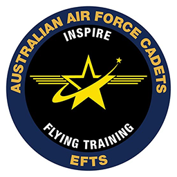

# vEFTS

<figure>

  

<figcaption></figcaption>
</figure>

### Introduction
Welcome to the vElementary Flight Training Course in the DA40NG for Microsoft Flight Simulator. This may be your first introduction to flying on the VATSIM network or first time flying Visual Flight Rules (VFR) and along with the RAAFv instructors, we will be using the VATSIM Pilot Learning Centre to provide you the confidence and competence with flying on the VATSIM network.

This course has a total of six repeatable lessons, in RAAFv we call them “Sorties” and your progression through these sorties will be aided by the RAAFv Qualified Flight Instructors (QFI) to help gain your successful completion of this course. “Repeatable Sorties” are sorties that are signed off by the QFI after each flight and by simply completing the sortie, it does not imply that sortie to be successful and may be required to be flown again. Feedback will provided to speed up your success. 

### Reason
After the successful completion of this course you will gain your DA40NG aircraft endorsement for RAAFv and will be eligible for sitting your Military Pilot Licence (MPL) 1 (when it gets implemented)

### Course Learning Outcomes (CLO)  
On successful completion of this course you will be able to confidentially conduct the following:  

* Perform pre-flight administrative actions (METAR, Crew Portal, Flight Filing).  
* Perform RAAFv related systems actions (ACARS, vPilot, Voltana, JoinFS).  
* Demonstrate understanding of Radio Telephony.  
* Demonstrate basic VFR flying.  
* Demonstrate understanding of VATSIM airspaces.  

### Course References and Links
* RAAFv OPMAN  
* <a href="https://1drv.ms/i/s!Ag-Zb3q7TOEgguBVaG5QgH_jaEwVgg?e=gOg3aa" target="_blank">DA40NG Checklist</a>
* <a href="https://crew.raafvirtual.org/dmarket" target="_blank">RAAFv Base East Sale Scenery</a>

---

### Sorties
#### vEFTC - Sortie 1 (EGF-1)
**Flight Administration & Airborne Activities**

In this lesson, you will learn the required pre and post-flight actions for RAAF Virtual activities on the VATSIM network along with common ground and circuit procedures for RAAFv Base East Sale.
 
??? Warning "Flight Setup"
    **Weather**: "Clear Skies"  
    **Time of Day**: "Day Time"  
    **Aircraft Configuration**: "Clean"  
    **Fuel**: "Full"  
    **VATSIM Flight Plan**: "YMES DCT R360"  
    **VATSIM Remarks**: "RMK/OPS WI R360 YMES CIRA"  

??? "SORTIE 1 LO1: PERFORM PRE-FLIGHT ADMINISTRATIVE ACTIONS"
    - Locate suitable METAR information for the departure and arrival airport prior to flight.  
    - Perform a risk assessment for the sortie by taking into account departure, cruise and arrival conditions and contributing factors.  
    - Determine suitable airframe availability.  
    - Mitigate risk by making calculated judgment and referring to a QFI where practical.  
    - Connect appropriate software from simulator to RAAFv networks (vPilot, ACARS, JoinFS etc).  
    - File an appropriate flight-plan on VATSIM using vPilot.  
    - Set the simulation conditions correctly based on real world conditions, or as required to meet the lesson objectives.
    
??? "SORTIE 1 LO2: PERFORM GROUND & AIR OPERATIONS WITHIN THE YMES CIRTUIT AREA"  

    - Perform ground based checklist actions to set up and configure the aircraft for safe flight.  
    - Peform engine start procedures.  
    - Perform taxi.  
    - Perform the following as part of a standard circuit pattern;   
        * Perform a standing take-off.
        * Perform a normal climb and level off.
        * Perform a statndard circuits pattern.
        * Perform trimming of the aircraft.
        * Perform straight and level flight.
        * Perform a standard turn (updind → crosswing → downwind → base → final).
        * Perform a normal landing.
        * Perform in-flight checks.
        * Perform radio communications.
        * Manage situationsal awareness in flight.

??? "SORTIE 1 LO3: PERFORM POST-FLIGHT ADMINISTRATIVE ACTIONS"  

     - Complete the following post-flight actions:
        * End flight on ACARS prior to disconnecting from VATSIM.
        * Disconnect appropraite software from the simulator to networks (vPilot, JoinFS, YourControls etc).

### Sortie One Ground School
1. <a href="https://www.youtube.com/watch?v=8PTtWH90qUE&t=2s">Getting Started in RAAFv (YouTube)</a>
2. <a href="https://www.youtube.com/watch?v=QCZhjeg9aDI&t=1s">Welcome to RAAFv Base East Sale (YouTube)</a>  

**Introduction**
The normal circuit direction used is left hand, in that all turns in the circuit are to the left. Left hand circuits are assumed throughout this chapter; although cadet trainees should note that the circuit direction for RWY27 and RWY04 at East Sale, is right hand.

<figure>

  

<figcaption>Live and Dead Side</figcaption>
</figure>

**Take Off**  
The take-off is conducted as normal

<figure>

  

<figcaption>DA40NG Take Off</figcaption>
</figure>

**Upwind**
The aim of the upwind leg is to climb the aircraft on the runway extended centreline to not below 500' AGL.

After take-off, climb out on a heading to maintain the extended runway centreline at 72 KIAS and T/O flap. Ensure that you maintain visual contact with any aircraft ahead.

Upon passing 300' AGL, select flaps up, let the aircraft accelerate to 88 KIAS and reduce power to 90%.

**Weather Considerations**

If there is a crosswind on take-off the aircraft should be allowed to weathercock (yaw) towards the direction of wind at lift off. This heading (“drift kill heading”) is normally sufficient to overcome the effect of wind, thereby allowing the aircraft to track the extended centreline of the runway on the upwind leg.

**Traffic Considerations**

Circuit spacing from aircraft ahead is achieved by extending the upwind leg until the preceding aircraft is well clear. Before entering the crosswind turn carry out a thorough lookout. As a guide you should not commence the crosswind turn until the preceding aircraft has passed abeam you on its downwind leg. If the preceding aircraft is flying a larger circuit, wait until that aircraft is in about the 8 o’clock position.

If you executed a go around on a previous circuit because you were too close to a preceding aircraft, delay your crosswind turn further to prevent this happening again. In some situations, this may mean that you will not commence the crosswind turn until level at circuit height.

**Concluding the Upwind Leg**

After conducting a thorough lookout and satisfied with circuit spacing, make your crosswind R/T i.e. "Sale Traffic, Astra 476, Crosswind, Runway 09, Sale." and commence a 20° AoB turn onto the crosswind leg.

**Crosswind**
The aim of the crosswind leg is to track 90° from the runway centreline to achieve the desired spacing for the downwind leg. This will often include completing the climb to circuit height of 1000' AGL.

Crosswind Work Cycle

Once established on crosswind, the work cycle on crosswind is:
<figure>

  

<figcaption>ALAP Work Cycle</figcaption>
</figure>

**ATTITUDE**  
* As required to maintain 88 KIAS;

**LOOKOUT**  
* Looking for aircraft on downwind;

**ATTITUDE**  
* As required to maintain 88 KIAS;

**PERFORMANCE**  
* 88 KIAS; Altimeter (how far to level off?)

**Considerations**

The aircraft is levelled off at 1000' AGL, using 30' anticipation; setting the attitude for 90-95 KIAS and PCL to 50%. Do this by keeping your eyes out the front to maintain the attitude and heading, whilst reducing the power by feel and then trimming.

If the crosswind turn was initiated from upwind at, or shortly after 600' AGL, a turn onto downwind can be initiated shortly after levelling off at 1000' AGL.
However, if the crosswind turn was later, due to traffic or some other reason, it may be necessary to delay the turn onto downwind, well until after levelling off, to allow for the correct spacing on downwind. You may find it useful to use ground features under the downwind track to assist you in judging the spacing.

**Concluding the Crosswind Leg**

After conducting a thorough lookout and satisfied with circuit spacing, ensure straight and level, make your downwind R/T i.e. "Sale Traffic, Astra 476, Downwind, Runway 09, Sale." and commence a 30° AoB turn onto the downwind leg.

**Downwind**
The aim of the downwind leg is to fly level at 1000' AGL parallel to the runway at the correct spacing, on the reciprocal track at 95-100 KIAS.

At the start of downwind ensure the correct power and attitude are set, and the aircraft is accurately trimmed. When setting the attitude look ahead and pick a feature that you can fly towards on downwind. By doing this you can any changes to heading each time you check your attitude.

TRIM! Making the effort for accuracy here means that the aircraft is less likely to diverge from the downwind height and speed.

**Downwind Work Cycle**

Once established on downwind, the work cycle is:

**ATTITUDE**  
* Straight and Level.

**HEIGHT**  
* 1000' AGL.

**SPEED**  
* 95-100 KIAS.

**ATTITUDE**  
* Straight and Level.

**HEADING**  
* On runway reciprocal heading, tracking to downwind feature.

**SPACING**  
* Runway centreline through wing markings with wings level.

Considerations

If the performance is outside the parameters, change the attitude, power and/or heading as required. Remember that only by initially having set an accurate power, attitude and heading will you be able to make a ‘calculated’ correction. Two or more of these parameters may need to be changed simultaneously to correct any error/s.

Corrections to downwind spacing are in two stages. These are:

1. Correcting the original error; and on subsequent circuits,
2. Preventing it re-occurring.

There are many combinations of errors that may need correcting and with the assistance of your instructor you should be able to assess the best way to correct them.

**Before Landing Checks**

After completing the first full work cycle on downwind (ATTITUDE - HEIGHT - SPEED / ATTITUDE - HEADING - SPACING), perform the before landing checks.
Threshold speed for a normal circuit is generally 75 KIAS, however, check the QRH landing chart for aircraft weight to confirm. When carrying out the before landing checks, ensure that you continue to confirm the attitude and heading remain unchanged between every one or two items of the checklist. If necessary, stop the checklist and make a correct before continuing the checks.

**Selection of T/O Flap**

Continue the downwind work cycle until abeam the downwind threshold of the runway. At this point check the airspeed is less than 105 KIAS (minimum of 5kt buffer) and state “Speed below 110.”. Select T/O FLAP, moving the selector one click down. After a one second pause, push forward slightly on the controls to set the new attitude for 95 KIAS & T/O Flap, then trim. Check the flap indicator light to confirm flap position.

**Lookout**

Once trimmed, continue the work cycle and perform a thorough lookout of the area encompassing base and final, remembering that different aircraft types can perform larger circuits. When visual lookout is complete, make a declaration such as: "No aircraft on base and final.", "One ahead on base." or "One on short final.", etc..

Aircraft ahead will need to be considered in base radio call i.e. "Base Touch and Go, Number 2", and a visual contact maintained throughout the subsequent approach. In the event that an aircraft in front cannot be visually identified or re-identified, a go round would be required.

**Base**
The aim of the base leg is to position the aircraft at 500' AGL, on the extended centreline of the runway, on the correct glide slope at 85 KIAS. The heading across base should be adjusted to arrive on final at this desired distance from the landing threshold, identifying a ground feature at this point to assist in tracking and judging the turn.

**Commencing the Turn**

The base turn is commenced when the threshold is approximately 45° behind the aircraft wing. In strong winds, consideration should be made to initiating at an earlier angle. While extending on downwind should be avoided where possible, it may become necessary for ATC or traffic requirements.

When ready to turn base turn, retard the PCL to 20% and commence a 30° AoB level turn. At 90 KIAS lower the nose to maintain 85KIAS, rolling out on a heading to track 90° to the runway heading. Confirm attitude for 85 KIAS and PCL 20% before making the base radio call. i.e. "Sale Traffic, Astra 476, Base, Runway 09, Sale."

**Base Descent Technique**

To achieve the desired height of 500' AGL on final, within a 400-600' AGL window; it is necessary to control the descent. This is achieved by maintaining attitude for a specific speed and adjusting the rate of descent (RoD). This controlled descent is achieved utilising the standard descent technique: where

ATTITUDE controls AIRSPEED; and
POWER controls RATE OF DESCENT.
Base Work Cycle

The use of the work cycle on the base leg is:

**ATTITUDE**
As required to maintain 85 KIAS;

**LOOKOUT**
Lookout for the runway extended centreline ground feature and aircraft any ahead;

**ATTITUDE**
As required to maintain 85 KIAS;

**PERFORMANCE**
85 KIAS, ~750' AGL halfway through the base leg.

If you have used the correct technique you should roll out on final at 500' AGL at 85 KIAS on the correct glide slope. If you roll out on final below 400' AGL you will either be too shallow or will have insufficient time to stabilise on final in order to safely continue and you should conduct a go-around.

If you roll out above 600' AGL the glide path may be too steep to safely continue, and as such, you should conduct a go-around.

**Final**
The aim of the final approach leg is to fly the aircraft down the correct glide slope in order to cross the threshold at the nominated Vref speed.

Once rolled out on final check that the airspeed is below 98 KIAS and select Flap DN. Set the attitude for the desired aim point, being the runway numbers, which should be approximately a third of the way up the windscreen, then re-trim.

The aircraft should decelerate without a further power change to 80 KIAS; which should be maintained with PCL changes as required.

Once established on final, commence the final work cycle: AIMPOINT - ASPECT - AIRSPEED

After confirming final attitude and power are stable, conduct the final checks; which should be completed around 300-400' AGL, but not later than 200' AGL.

**Aim Point**

Aim point is a point that remains fixed in the windscreen where the aircraft will impact unless the aircraft attitude is altered (i.e. flared for landing). Aim point is controlled by use of the elevator to make small pitch changes; where accurate use of elevator trim will assist greatly.

Being able to detect any movement of the aim point is important and therefore you must not only be satisfied with ‘still being able to see the numbers’, but pay attention to exactly where they appear in the windscreen and where you want them to appear.

**Aspect**

Runway aspect will give glide slope information. If the runway appears to be long and thin then your glide slope is too steep. If the runway appears to be flat, then your glide slope is too shallow.
Fig 6.6 illustrates different aspects. If aspect is high or low you should make a power and attitude change to re-intercept glide slope. If you are low for example, the attitude will have to be raised and increase power to maintain 75-80 KIAS. Once re-established on glide slope adjust attitude back for the aim point and power to maintain 80 KIAS.

**Airspeed**

Airspeed on final is to be maintained at 80 KIAS for a normal circuit, reducing to 75 KIAS on short final, and is controlled by power. If you note an airspeed error, use power positively to re-establish 80 KIAS, but remember to anticipate with PCL once you have re-established 80 KIAS.

Re-trim on final approach for any significant power or IAS change. Problems in maintenance of airspeed on final approach can often be traced back to inaccurate trimming. Always try to carry some power (at least 10-15%) immediately prior to the flare to prevent high rates of descent in the flare and allow for immediate PCL response if needed.

**Flare and Touchdown**
The constant flight path is maintained down final approach until the aircraft approaches flare height, approximately 10-15' AGL. The aim of the flare can be described as reducing the rate of descent to zero at about 1-2' AGL; or levelling off. The key to this lies in keeping your eyes focused on the end the runway throughout the flare and landing.

The flare height can be assessed various ways and your instructor will show you how. Approaching the flare height look at the far end of the runway. Look for the flare cues in your peripheral vision. At the flare height raise the nose to the flare attitude at the rate shown to you by your instructor. This will reduce the rate of descent so that the aircraft is now flying level just above the runway.

The PCL is closed at the commencement of the flare and the hold-off, if required, achieved by gradually raising the nose to the landing attitude. This will reduce the rate of descent so that the aircraft sinks gently towards the runway whilst the aircraft decelerates. Do not raise the nose as far as the horizon, as this can lead to a tail strike.

Once the main wheels touch the runway hold the back stick position until the nose wheel lowers itself onto the runway. Directional control on the ground is maintained throughout by rudder initially and then asymmetric braking.

**Landing Roll**

Progressively move the control column to the rear as you apply brakes. This will keep the aircraft weight on the main wheels allowing maximum braking and reduces the chance of the tyre skidding over the runway and a possible blown tyre.

Smoothly decelerate the aircraft by one smooth, continuous application of brake, keeping straight by applying slightly more pressure on the required side. Before turning off the runway, assess the aircraft’s ground speed. If you are too fast do not hesitate to allow the aircraft to continue, as it is easy to back track or simply taxi forward to the next taxiway. Do not be tempted to apply heavy brakes in an attempt to exit a runway early as this can easily lead to a blown tyre.

Once clear of the active runway call "Clear of Runway XX" or "Clear of all runways", then stop to complete the after-landing checks. These checks are performed with the aircraft stationary, or until your instructor authorises you to carry them out while taxiing back to the apron.

**Touch and Go**

Once the aircraft is under control, select T/O Flap (lever one click up) by feel. Confirming that you are on the centreline, check the flap indicator light and smoothly apply full power whilst keeping your eyes out the front. A small check forward may be required to stop the nose rising prematurely, whilst right rudder will often be required to keep straight.

Check inside to confirm full power and RPM, then runway centreline and airspeed, rotating at Vr (normally around 65 KIAS), setting a gentle climb for few monuments before raising the nose at 72 KIAS to set max rate climb attitude.

When visually above 100' AGL, retard the PCL only half an inch or so to set 90% by feel. Check the power by glance and adjust by feel as required. Conduct the after take-off checks at 500' AGL as per the normal take-off.

---

#### vEFTC - Sortie 2 (EGF-2)
**Circuit Departure & Rejoin**

In this lesson, you will learn the required procedure to correctly and accurately depart from and rejoin to the RAAFv Base East Sale CIRA via one of the local Training Areas (TA).  You will also be required to demonstrate a sufficient understanding of the ALAP workcycle and appropriate checklist actions.
 
??? Warning "Flight Setup"
    **Weather**: "Clear Skies"  
    **Time of Day**: "Day Time"  
    **Aircraft Configuration**: "Clean"  
    **Fuel**: "Full"  
    **VATSIM Flight Plan**: "YMES DCT R360"  
    **VATSIM Remarks**: "RMK/OPS WI R360 YMES CIRA"  

??? note "SORTIE 2: LO1. PERFORM PRE-FLIGHT ADMINISTRATIVE ACTIONS"
    - Locate suitable METAR information for the departure and arrival airport prior to flight.  
    - Perform a risk assessment for the sortie by taking into account departure, cruise and arrival conditions and contributing factors.  
    - Determine suitable airframe availability.  
    - Mitigate risk by making calculated judgment and referring to a QFI where practical.  
    - Connect appropriate software from simulator to RAAFv networks (vPilot, ACARS, JoinFS etc).  
    - File an appropriate flight-plan on VATSIM using vPilot.  
    - Set the simulation conditions correctly based on real world conditions, or as required to meet the lesson objectives.  

??? note "SORTIE 2: LO2. PERFORM AIR OPERATIONS WITHIN A SUITABLE INNER TRAINING AREA."

    - Perform ground based checklist actions to set up and configure the aircraft for safe flight.  
    - Peform a standing take-off.
    - Perform a normal climb and level off.
    - Perform a visual departure to a suitable Training Area (Alpha-Hotel permitted).
    - Maintina flight within applicable designated airspace vertical and lateral limits.
    - Perform general flying (GF) workcycles during flight (ALAP/SHT).
    - Perform a rejoin to the East Sale Circuit Area (CIRA).
    - Perform an upwing recovery.
    - Perform a normal landing.
    - Perform a crosswing landing.
    - Perform in-flight checks.
    - Perform radio communications.
    - Manage situation awareness in flight.

??? note "SORTIE 2: LO3. PERFORM POST-FLIGHT ADMINISTRATIVE ACTIONS"
    - Complete the following post-flight actions:
        * End flight on ACARS prior to disconnecting from VATSIM.
        * Disconnect appropraite software from the simulator to networks (vPilot, JoinFS, YourControls etc).

---

#### vEFTC - Sortie 3 (EGF-3)
**Climbing, Desecending & Turning**

In this lesson you will demonstrate and be assessed on your ability to perform standard climbs and descents using required workcycles such as Power, Attitude, Trim (PAT) and Attitude, Power, Trim. (APT).  Additionally, you will learn the required procedure to correctly and accurately perform medium (up to 30 degree AoB) and steep (up to 45 degree AoB) level, climbing and descending turns.
 
??? Warning "Flight Setup"
    **Weather**: "Clear Skies"  
    **Time of Day**: "Day Time"  
    **Aircraft Configuration**: "Clean"  
    **Fuel**: "Full"  
    **VATSIM Flight Plan**: "YMES DCT R360"  
    **VATSIM Remarks**: "RMK/OPS WI R360 YMES CIRA"  

??? note "SORTIE 3: LO1. PERFORM PRE-FLIGHT ADMINISTRATIVE ACTIONS"
    - Locate suitable METAR information for the departure and arrival airport prior to flight.  
    - Perform a risk assessment for the sortie by taking into account departure, cruise and arrival conditions and contributing factors.  
    - Determine suitable airframe availability.  
    - Mitigate risk by making calculated judgment and referring to a QFI where practical.  
    - Connect appropriate software from simulator to RAAFv networks (vPilot, ACARS, JoinFS etc).  
    - File an appropriate flight-plan on VATSIM using vPilot.  
    - Set the simulation conditions correctly based on real world conditions, or as required to meet the lesson objectives.  

??? note "SORTIE 3: LO2. PERFORM AIR OPERATIONS WITHIN A SUITABLE INNER TRAINING AREA."

    - Perform a visual departure to a suitable inner Training Area.
    - Maintain flight within the applicable designated airspace vertical and lateral limits.
    - Perform GF workcycles during flight (ALAP/SHT).
    - Operate the autopilot heading and altitude modes.
    - Perform a cruise descent.
    - Perform a glide descent - Clean.
    - Perform a glide descent - Configured (Flaps LDG).
    - Perform a standard climb.
    - Perform a standard turn through 360°.
    - Perform a standard turn while descending 1000ft.
    - Perform a standard turn while climbing 1000ft.
    - Perform climb/descent workcycles (PAT - Power Attitude Trim) and (APT - Attitude Power Trim).
    - Perform a rejoin to the East Sale Circuit Area (CIRA).
    - Perform a normal landing.
    - Perform in-flight checks.
    - Perform radio communications.
    - Manage situation awareness in flight.

??? note "SORTIE 3: LO3. PERFORM POST-FLIGHT ADMINISTRATIVE ACTIONS"
    - Complete the following post-flight actions:
        * End flight on ACARS prior to disconnecting from VATSIM.
        * Disconnect appropraite software from the simulator to networks (vPilot, JoinFS, YourControls etc).

---

#### vEFTC - Sortie 4 (EGF-4)
**Stalling & Unusual Attitudes**

In this lesson, you will learn the required procedure to correctly, accurately and safely perform slow flight and power off stalls, in addition to the safe demonstration of the HASELL checks as a pre-requisite for these activities.
 
??? Warning "Flight Setup"
    **Weather**: "Clear Skies"  
    **Time of Day**: "Day Time"  
    **Aircraft Configuration**: "Clean"  
    **Fuel**: "Full"  
    **VATSIM Flight Plan**: "YMES DCT R360"  
    **VATSIM Remarks**: "RMK/OPS WI R360 YMES CIRA"  

??? Danger
    Due to the limitations of MSFS2020, no aircraft are permitted to perform a fully developed stall.

??? note "SORTIE 4: LO1. PERFORM PRE-FLIGHT ADMINISTRATIVE ACTIONS"
    - Locate suitable METAR information for the departure and arrival airport prior to flight.  
    - Perform a risk assessment for the sortie by taking into account departure, cruise and arrival conditions and contributing factors.  
    - Determine suitable airframe availability.  
    - Mitigate risk by making calculated judgment and referring to a QFI where practical.  
    - Connect appropriate software from simulator to RAAFv networks (vPilot, ACARS, JoinFS etc).  
    - File an appropriate flight-plan on VATSIM using vPilot.  
    - Set the simulation conditions correctly based on real world conditions, or as required to meet the lesson objectives.
 

??? note "SORTIE 4: LO2. PERFORM SLOW FLIGHT & STALLS."

    - Perform a visual departure to Training Area Alpha (R360).
    - Maintain flight within  applicable designated airspace vertical and lateral limits.
    - Perform HASELL checks prior to maneouvres.
    - Perform clean stall entry, recognition and recovery.
    - Perform configured stall entry, recognition and recovery.
    - Perform configured flight within the upper air circuit.
    - Perform radio communications. 
    - Manage situation awareness in flight.

??? note "SORTIE 4: LO3. PERFORM POST-FLIGHT ADMINISTRATIVE ACTIONS"
    - Complete the following post-flight actions:
        * End flight on ACARS prior to disconnecting from VATSIM.
        * Disconnect appropraite software from the simulator to networks (vPilot, JoinFS, YourControls etc).

---

#### vEFTC - Sortie 5 (EGF-5)
**Solo Emergencies & Emergencies Handling (ANCA)**

In this lesson, you will learn the required procedure to correctly and accurately perform the ANCA workcyle (Aviate, Navigate, Communicate, Administrate.)  This will be done via time critical and non-time critical emergency actions.
 
??? Warning "Flight Setup"
    **Weather**: "Clear Skies"  
    **Time of Day**: "Day Time"  
    **Aircraft Configuration**: "Clean"  
    **Fuel**: "Full"  
    **VATSIM Flight Plan**: "YMES DCT R360"  
    **VATSIM Remarks**: "RMK/OPS WI R360 YMES CIRA"  

??? note "SORTIE 5: LO1. PERFORM PRE-FLIGHT ADMINISTRATIVE ACTIONS"
    - Locate suitable METAR information for the departure and arrival airport prior to flight.  
    - Perform a risk assessment for the sortie by taking into account departure, cruise and arrival conditions and contributing factors.  
    - Determine suitable airframe availability.  
    - Mitigate risk by making calculated judgment and referring to a QFI where practical.  
    - Connect appropriate software from simulator to RAAFv networks (vPilot, ACARS, JoinFS etc).  
    - File an appropriate flight-plan on VATSIM using vPilot.  
    - Set the simulation conditions correctly based on real world conditions, or as required to meet the lesson objectives.
 

??? note "SORTIE 5: LO2. PERFORM GROUND BASED EMERGENCY HANDLING."

    - Perform emergency and departure brief, advising intentions to 'practive' an aborted take-off.
    - Perform an aborted take-off.

??? note "SORTIE 5: LO3. PERFORM AIRBORNE BASED EMERGENCY HANDLING."

    - Perform a normal take-off and remain in the circuit.
    - Practive a communications failure within the circuit pattern.
    - Practice an Engine Failure After Take-Off (EFATO).
    - Depart the circuit for an visual departure to the Training Area.
    - Practive Brirdstrike and Controllability Checks.
    - Perform emergency handling techniques (ANCA - Aviate Navigate Communicate Administrate).
    - Perform applicable emergency checklists.
    - Practive a Forced Landing due to a practive engine failure.
    - Perform a normal landing.

??? note "SORTIE 5: LO4. PERFORM POST-FLIGHT ADMINISTRATIVE ACTIONS"
    - Complete the following post-flight actions:
        * End flight on ACARS prior to disconnecting from VATSIM.
        * Disconnect appropraite software from the simulator to networks (vPilot, JoinFS, YourControls etc).

---

### Assessment

#### vEFTC - Sortie 6 (EGF-6)
**Area Solo Test**

During this assessment, you will perform general flying consolidation under observation by an examining instructor.
 
??? Warning "Flight Setup"
    **Weather**: "Clear Skies"  
    **Time of Day**: "Day Time"  
    **Aircraft Configuration**: "Clean"  
    **Fuel**: "Full"  
    **VATSIM Flight Plan**: "YMES DCT R360"  
    **VATSIM Remarks**: "RMK/OPS WI R360 YMES CIRA"  

??? abstract "SORTIE 6: ASSESSMENT CRITERIA"
    - **Administration:**
        - Demonstrate pre-post flight adminstration.
        - Demonstrate ground based checks and procedures.
        - Demonstrate airborne checks and procedures.
    - **Emergency Handling:**
        - Demonstrate a practice aborted take-off.
        - Demonstrate an Engine Failure After Take-Off.
        - Demonstrate (ANCA - Aviate Navigate Communicate Administrate) in a practical setting.
    - **Basic Handling:**
        - Demonstrate a standing take-off.
        - Demonstrate a visual departure to the training area.
        - Demonstrate trimming the aircraft.
        - Demonstrate a stright and level flight.
        - Demonstrate a standard rate turn.
    - **Climb and Descents:**
        - Demonstrate a normal climb.
        - Demonstrate a descent at cruise power.
        - Demonstrate an idle descent in clean configuration.
        - Demonstrate an idle descent in landing configuration.
    - **Aircraft Systems:**
        - Demonstrate operation of the Autopilot system in heading and altitude hold modes.
    - **Stalls and Unsual Attitudes:**
        - Demonstrate the recognition of a stall.
        - Demonstrate recoveries from nose high and nose low unsual attitudes.
        - Perform a forced practice landing.
    - **Rejoing:**
        - Demonstrate a visual approach to East Sale.
    - **Circuits:**
        - Demonstrate a normal circuit.
        - Demonstrate a go-around from base leg.
        - Demonstrate a flapless circuit.
        - Demonstrate a low-level circuit.
        - Demonstrate a normal landing.
        - Demonstrate a crosswind landing.
    - **RAAFv Systems:**
        - Demonstrate operations of vPilot, .AIRCRAFT, JoinFS, Volanta, Manual PIREP and ACARS. 

### Conclusion
Well done on completing your first RAAFv aircraft endorsement course! With this brand new qualification you are permitted to fly the DA40NG on ACARS within the R360 airspace without a QFI onboard. You are confined to the R360 (YMES Training Area) until you have completed v2FTS. This will allow the DA40 aircraft to remain at YMES for the other students. You are welcome to fly the DA40 without being on ACARS anywhere, however we'd like to see you focus on your next course, **IN THE PC21!!!**
