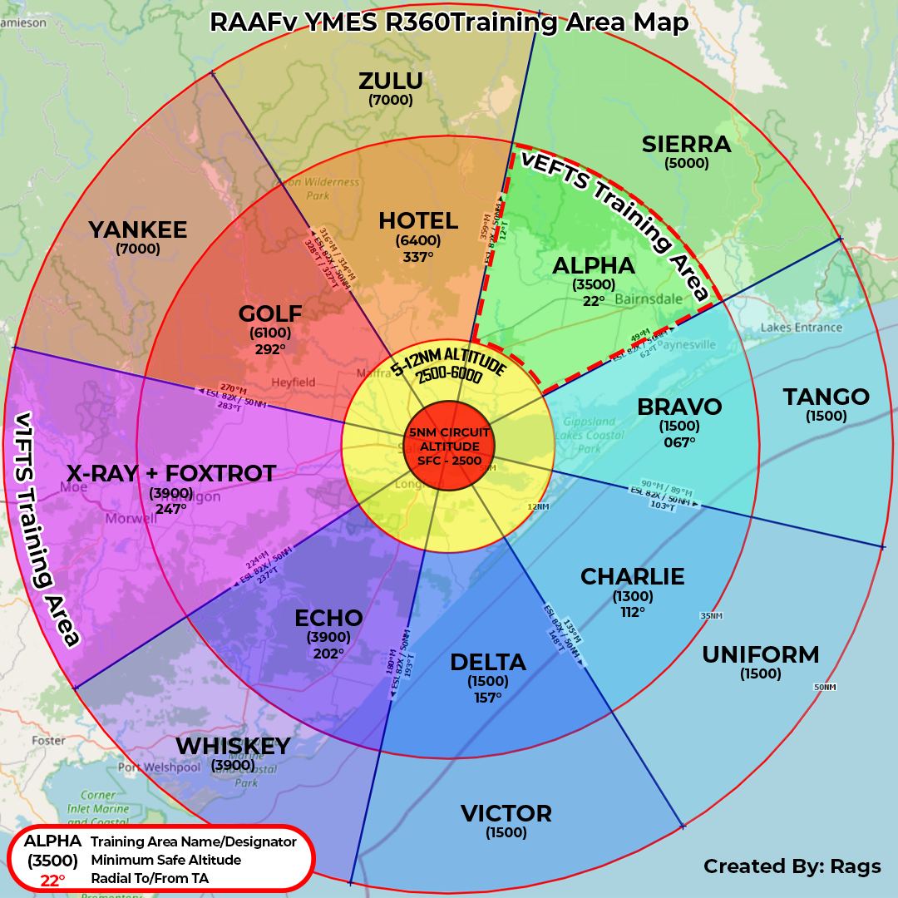

# YMES Recources

### Welcome to RAAF Base East Sale (YMES)
As part of your flying training here at RAAF Virtual, we welcome you to the Elementary Flying Training Course in the Diamond DA40 NG at RAAFv Base East Sale.

Prior to your first flight at East Sale (ICAO: YMES), a RAAF Virtual Qualified Flight Instructor (vQFI) can be made available to you for support or briefing prior to you undertaking your initial sortie to ensure your software and components are functional for the course.  

Please ensure you have downloaded and installed the contents of 'Module 1 - Course Resources' prior to undertaking this course.

Should you require further assistance at this stage, please join the RAAF Virtual Discord Server and inform one of the vQFIs of your availability.  This can be done by contacting your instructor via the <a href="https://discord.com/channels/293624265633431562/864280594749849600">efts-discussion Discord text channel.</a>

??? Icon "Welcome to East Sale Video"
    <figure>
    

### Handy Links
* <a href="https://ais-af.airforce.gov.au/australian-aip">Australian AIP Library</a>

### East Sale R360 Training Area
<figure>

</figure>

### East Sale Parking Lines
<figure>

</figure>

### East Sale Taxi Routes
The taxi routes are a recommendation only. These are not mandatory, but will aid in the general "flow of traffic" when conducting operation with no ATC online. When ATC is online please follow their direction.
<figure>

  

<figcaption>RWY22 Recommended Taxi Routes</figcaption>
</figure>
<figure>

  

<figcaption>RWY27 Recommended Taxi Routes</figcaption>
</figure>
<figure>

  

<figcaption>RWY09 Recommended Taxi Routes</figcaption>
</figure>
<figure>

  

<figcaption>RWY04 Recommended Taxi Routes</figcaption>
</figure>

!!! note "RWY04 ORP (Operational Readiness Platform)"
    Taxi from the vEFTS lines to RWY04 doesn't take you past a check bay, therefor your before take off/runup checks are conducted at the ORP.

!!! danger ""
    The ORP is within the runway gabels and request from ATC is required to enter the ORP. If no ATC online advise via UNICOM 122.800 that you are entering the RWY04 ORP.